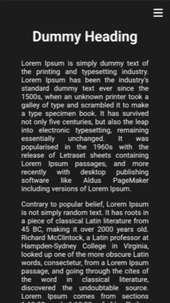

## Day 02 - Sidebar Menu

### Links

Live link: [https://sruthi-nair166.github.io/100dayscodingchallenge/2.SidebarMenu/](https://sruthi-nair166.github.io/100dayscodingchallenge/2.SidebarMenu/)

### Overview

A responsive sidebar navigation menu with smooth open-close transitions and basic accessibility considerations.

### Screenshot

### What I worked on

- Built a responsive sidebar menu with a hamburger toggle for mobile screens
- Implemented smooth open/close transitions for the sidebar
- Added accessible features: focus management and ARIA attributes
- Managed overlay and close buttons to enhance usability

### What I learned

- How to handle state toggling (open/close) between menu, overlay, and close button
- Implementing smooth CSS transitions without breaking responsiveness
- Balancing accessibility with dynamic UI components
- Debugging CSS layout issues in complex, responsive navigation
