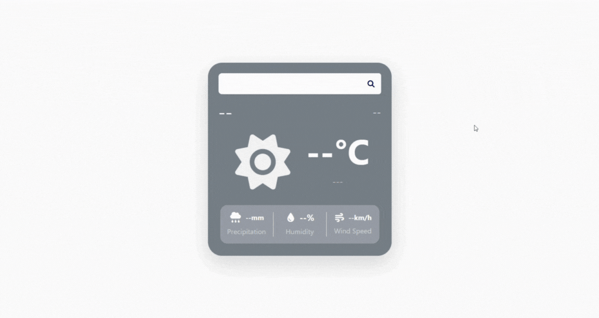

## Day 03 - Weather App

### Links

Live link: [https://sruthi-nair166.github.io/100dayscodingchallenge/3.WeatherApp/](https://sruthi-nair166.github.io/100dayscodingchallenge/3.WeatherApp/)

### Overview

A weather application that fetches live weather data and updates the UI based on conditions and time of day.

### Screenshot

### What I worked on

- Fetching current weather data from the OpenWeatherMap API
- Displaying temperature, weather condition, humidity, wind speed, and precipitation
- Detecting day vs night using sunrise and sunset timestamps
- Updating the UI theme based on day/night state
- Handling invalid city searches and API errors

### What I learned

- Working with third-party APIs and parsing JSON responses
- Handling conditional data that may or may not exist in an API response
- Using Unix timestamps to determine real-world states (day vs night)
