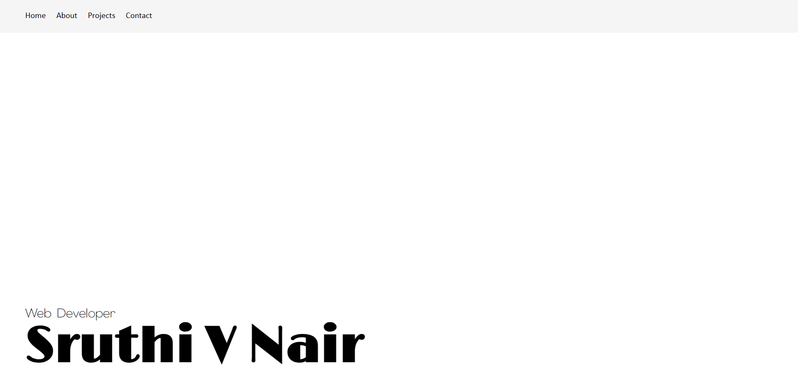

## Day 05 - Responsive Portfolio (using React)

### Links

Live link: 

### Overview

A responsive portfolio layout built using React and CSS, focusing on component structure, props-based data flow, and responsive design. The goal of this implementation is to demonstrate React fundamentals such as component composition and dynamic rendering.

### Screenshot

### What I worked on

- Structuring the application using functional React components
- Organizing UI into logical, reusable components
- Passing project and skill data via props
- Dynamically rendering repeated sections using map
- Implementing responsive layouts for mobile, tablet, and desktop

### What I learned

- How data flows through a React application using props
- Using React to model UI behavior instead of direct DOM manipulation
